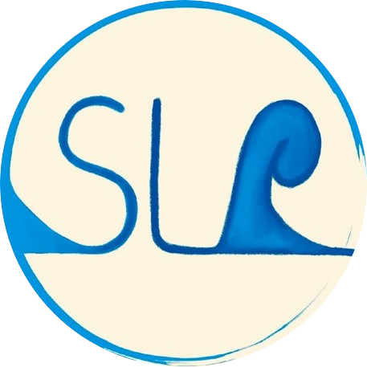

 

* * *
*   [About the project](#about-the-project)
*   [About us](#about-us)
*   [Repositories](#repositories)
*   [Our documentation](#our-documentation)
*   [Licensing](#licensing)
*   [Project status](#project-status)

* * *

# SeaLevelRaise documentation

NOTE: This README is also available in an outdated [German version](translations/README.de.md), which is not being updated.

HINWEIS: Diese README ist ebenfalls in einer veralteten [deutschen Version](translations/README.de.md) verfügbar, die nicht mehr aktualisiert wird.

## About the project
* * *
The project is part of the module _M3 Methods and Tools in BUI Projects_ in WiSe 2022/2023 of the Master's program BUI at HTW Berlin.

Sea Level Raise (SLR) is a donation platform for projects in so-called Small States, states with a small population and a small land area that are particularly affected by climate change.
Due to their low importance in the global country ranking, these states have so far had a problem being heard.

Through the Web3 project "Sea Level Raise" this problem is addressed, these are our three principles:

* __Fair Participation:__ SLR wants the voices of Small States to be heard. Through SLR, small states can make visible the consequences threatening their existence due to climate change and present their own proposals for solutions.

* __Fair funding:__ SLR wants to ensure that smaller projects can also be funded and that projects from Small States are also considered. Furthermore, SLR as a participatory distribution mechanism is attractive for donations from different sources, because e.g. companies can support climate projects without individuals having to fear that they have too much decision-making power.

* __Fair distribution:__ By organizing SLR as a DAO, fair distribution mechanisms will be established so that each donor can have a say in how their money is used.

## About us
* * *
We are the SeaLevelRaise project team and participants of the module _M3 Methods and Tools in BUI Projects_ in WiSe 2022/2023. The assignment for the project was given by Prof. Dr.-Ing. Katarina Adam (Katarina.Adam@HTW-Berlin.de). As supervisor, Prof. Dr. Frank Burghardt was available to us as university lecturer of the module.

__The SeaLevelRaise-Team:__

## Repositories
* * *
| Repository                   | Description                                                                                 |
| ---------------------------- | ------------------------------------------------------------------------------------------- |
| [SLR](https://gitlab.rz.htw-berlin.de/m3bui/SLR)            | - __nuxt:__ "Frontend", A web application, developed with the framework Vue and the metaframework nuxt - __truffle-project:__ "Backend", Smart Contracts, which can be migrated to an Etherium blockchain. There are instructions for running each of the two parts of the project in the subfolder.                         |
| [SLR Documentation](https://gitlab.rz.htw-berlin.de/m3bui/SLR-documentation)                | Project overview and general documentation                        |

## Our Documentation
* * *

### Requirements

- [User Journey](user-journey.md)

### Technical Documentation

- [Architecture](architecture.md)
- [Smart contract logic](contract-logic.md)
- [UX design guide](UX-design.md)
- [Install development](https://gitlab.rz.htw-berlin.de/m3bui/SLR/-/blob/main/README.md#projekt-set-up)

## Licensing
* * *

Copyright (c) 2023 SeaLevelRaise-Projektteam

Permission is hereby granted, free of charge, to any person obtaining a copy of this software and associated documentation files (the “Software”), to deal in the Software without restriction, including without limitation the rights to use, copy, modify, merge, publish, distribute, sublicense, and/or sell copies of the Software, and to permit persons to whom the Software is furnished to do so, subject to the following conditions:

The above copyright notice and this permission notice shall be included in all copies or substantial portions of the Software.

THE SOFTWARE IS PROVIDED “AS IS”, WITHOUT WARRANTY OF ANY KIND, EXPRESS OR IMPLIED, INCLUDING BUT NOT LIMITED TO THE WARRANTIES OF MERCHANTABILITY, FITNESS FOR A PARTICULAR PURPOSE AND NONINFRINGEMENT. IN NO EVENT SHALL THE AUTHORS OR COPYRIGHT HOLDERS BE LIABLE FOR ANY CLAIM, DAMAGES OR OTHER LIABILITY, WHETHER IN AN ACTION OF CONTRACT, TORT OR OTHERWISE, ARISING FROM, OUT OF OR IN CONNECTION WITH THE SOFTWARE OR THE USE OR OTHER DEALINGS IN THE SOFTWARE.

[Lizenzerklärung](SLRLizenz.pdf)

## Project Status
* * *

*If you have run out of energy or time for your project, put a note at the top of the README saying that development has slowed down or stopped completely. Someone may choose to fork your project or volunteer to step in as a maintainer or owner, allowing your project to keep going. You can also make an explicit request for maintainers.*
